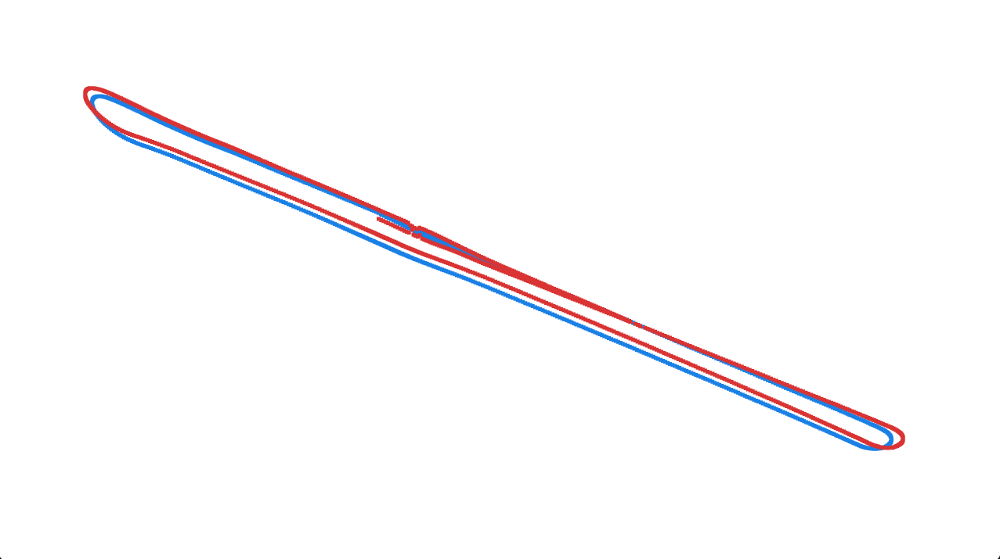

# Stereo SLAM Results

## KITTI Odometry Sequence 06



This run processes the first 950 frames from KITTI odometry sequence 06 using
the stereo SLAM pipeline. The system combines stereo visual odometry, local
bundle adjustment, VLAD loop detection, loop PnP verification, pose graph
optimization, and KITTI odometry evaluation.

This result uses the run stored at:

```text
outputs/VO/kitti_06_pgo_strict_20260511_2
```

Raw outputs:

- [metrics.json](../../outputs/VO/kitti_06_pgo_strict_20260511_2/metrics.json)
- [run.log](../../outputs/VO/kitti_06_pgo_strict_20260511_2/run.log)
- [estimated_trajectory.txt](../../outputs/VO/kitti_06_pgo_strict_20260511_2/estimated_trajectory.txt)
- [groundtruth_trajectory.txt](../../outputs/VO/kitti_06_pgo_strict_20260511_2/groundtruth_trajectory.txt)
- [frame_ids.txt](../../outputs/VO/kitti_06_pgo_strict_20260511_2/frame_ids.txt)

## Run Summary

| Item | Value |
| --- | ---: |
| Sequence | KITTI odometry 06 |
| Frames processed | 950 |
| Registered cameras | 950 |
| Cameras with ground truth | 950 |
| Final 3D points | 349,255 |
| Local bundle adjustment runs | 47 |
| Successful local bundle adjustment runs | 12 |
| Applied local bundle adjustment runs | 47 |
| Accepted loop edges | 9 |
| Pose graph optimization | enabled |
| Final global bundle adjustment | skipped |
| Alignment scale | 0.98613 |
| Visualization trajectory span | estimated 457.272, ground truth 457.69 |

## Loop Closure and PGO

Nine loop edges were accepted. The accepted loop closures connect the return
near frames 831-835 to the start of the sequence and frames 931-935 to frames
102-105.

```text
current=000831.png old=000000.png score=1.380 inliers=86
current=000835.png old=000001.png score=0.872 inliers=185
current=000835.png old=000000.png score=1.210 inliers=211
current=000835.png old=000002.png score=1.219 inliers=87
current=000931.png old=000102.png score=1.402 inliers=163
current=000931.png old=000103.png score=1.405 inliers=143
current=000935.png old=000105.png score=1.305 inliers=97
current=000935.png old=000104.png score=1.335 inliers=125
current=000935.png old=000103.png score=1.379 inliers=141
```

Pose graph optimization reduced the internal graph cost, but did not converge
within the configured function-evaluation limit:

| PGO Item | Value |
| --- | ---: |
| Keyframes | 950 |
| Edges | 958 |
| Loop edges | 9 |
| Initial cost | 27455.993 |
| Final cost | 917.794 |
| Success | false |
| Message | maximum function evaluations exceeded |

## Before and After PGO

The run logs evaluation metrics immediately before and after pose graph
optimization.

| Metric | Before PGO | After PGO |
| --- | ---: | ---: |
| ATE RMSE | 2.51079 | 2.51073 |
| Alignment scale | 0.98612 | 0.98613 |
| KITTI translation drift | 1.592% | 1.642% |
| KITTI rotation drift | 0.454 deg / 100 m | 0.600 deg / 100 m |
| Max rotation error | 2.915 deg | 23.927 deg |

## KITTI Subsequence Metrics

These are the KITTI odometry leaderboard-style relative pose metrics computed
over 100 m to 800 m subsequences.

| Metric | Value |
| --- | ---: |
| Segments | 461 |
| Mean translation drift | 1.642% |
| Median translation drift | 1.481% |
| Mean rotation drift | 0.600 deg / 100 m |
| Median rotation drift | 0.364 deg / 100 m |

| Segment length | Segments | Translation drift | Rotation drift |
| ---: | ---: | ---: | ---: |
| 100 m | 87 | 1.870% | 1.213 deg / 100 m |
| 200 m | 80 | 1.763% | 0.682 deg / 100 m |
| 300 m | 71 | 1.813% | 0.492 deg / 100 m |
| 400 m | 61 | 1.667% | 0.378 deg / 100 m |
| 500 m | 54 | 1.651% | 0.415 deg / 100 m |
| 600 m | 45 | 1.494% | 0.295 deg / 100 m |
| 700 m | 37 | 1.212% | 0.332 deg / 100 m |
| 800 m | 26 | 0.830% | 0.401 deg / 100 m |

## Aligned Pose Metrics

| Metric | Mean | Median | Max |
| --- | ---: | ---: | ---: |
| Rotation error | 1.501 deg | 0.990 deg | 23.927 deg |
| Position error | 2.16006 | 2.21625 | 5.73038 |

ATE RMSE after Umeyama alignment: 2.51073.
