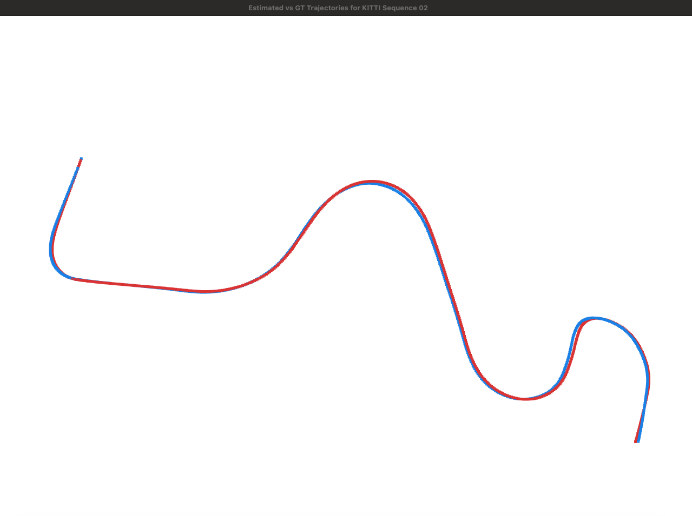

# Visual Odometry Results

## KITTI Odometry Sequence 02

This run processes the first 600 frames from KITTI odometry sequence 02. The
trajectory visualization compares the estimated trajectory with ground truth
using Umeyama alignment, with the first matched frame anchored at the origin.

Raw outputs:

- [metrics.json](../../outputs/VO/kitti_02/metrics.json)
- [run.log](../../outputs/VO/kitti_02/run.log)
- [estimated_trajectory.txt](../../outputs/VO/kitti_02/estimated_trajectory.txt)
- [groundtruth_trajectory.txt](../../outputs/VO/kitti_02/groundtruth_trajectory.txt)
- [frame_ids.txt](../../outputs/VO/kitti_02/frame_ids.txt)

## Run Summary

| Item | Value |
| --- | ---: |
| Sequence | KITTI odometry 02 |
| Frames processed | 600 |
| Registered cameras | 600 |
| Cameras with ground truth | 600 |
| Final 3D points | 298,646 |
| Local bundle adjustment runs | 29 |
| Successful local bundle adjustment runs | 29 |
| Alignment scale | 0.99704 |
| Visualization trajectory span | estimated 425.964, ground truth 424.988 |

## KITTI Subsequence Metrics

These are the KITTI odometry leaderboard-style relative pose metrics computed
over 100 m to 800 m subsequences. This 600-frame run produced valid subsequences
up to 600 m.

| Metric | Value |
| --- | ---: |
| Segments | 174 |
| Mean translation drift | 1.271% |
| Median translation drift | 1.284% |
| Mean rotation drift | 0.734 deg / 100 m |
| Median rotation drift | 0.654 deg / 100 m |

| Segment length | Segments | Translation drift | Rotation drift |
| ---: | ---: | ---: | ---: |
| 100 m | 50 | 1.232% | 0.879 deg / 100 m |
| 200 m | 41 | 1.132% | 0.696 deg / 100 m |
| 300 m | 33 | 1.197% | 0.681 deg / 100 m |
| 400 m | 25 | 1.386% | 0.648 deg / 100 m |
| 500 m | 17 | 1.530% | 0.662 deg / 100 m |
| 600 m | 8 | 1.621% | 0.662 deg / 100 m |

## Aligned Pose Metrics

| Metric | Mean | Median | Max |
| --- | ---: | ---: | ---: |
| Rotation error | 1.356 deg | 1.216 deg | 2.829 deg |
| Position error | 1.19094 | 1.16051 | 3.04702 |

ATE RMSE after Umeyama alignment: 1.25375.
